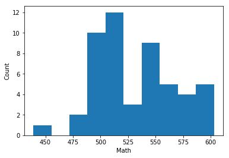
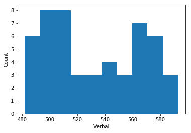
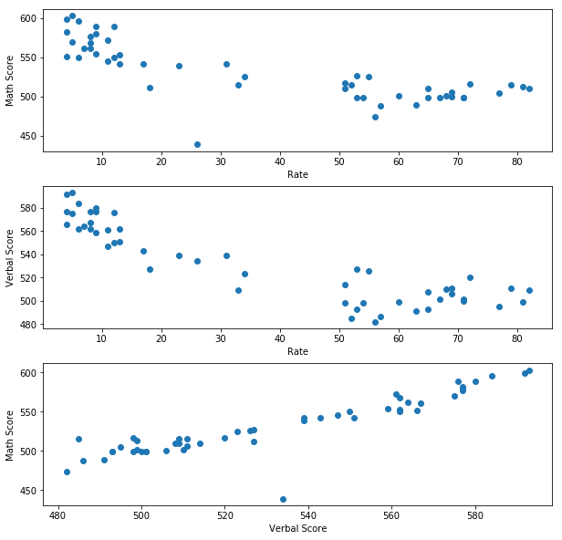
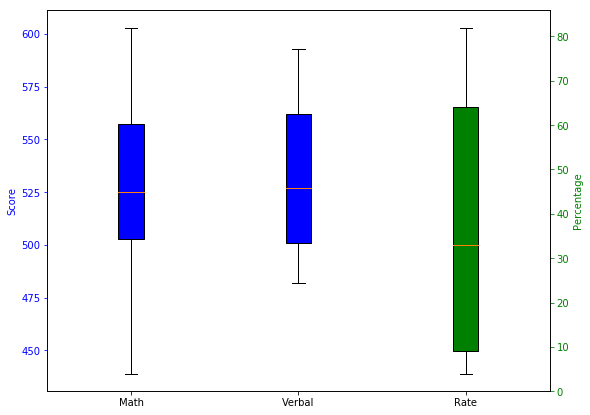
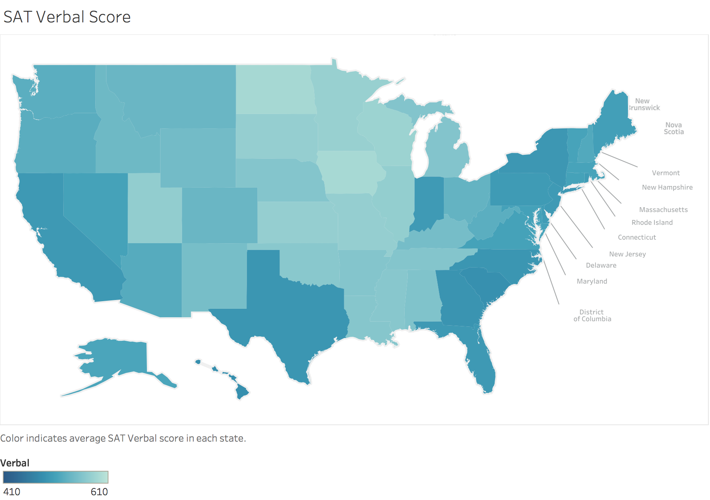

# Project 1

## Step 1: Open the `sat_scores.csv` file. Investigate the data, and answer the questions below.


```python
import numpy as np
import scipy.stats as stats
import csv
from matplotlib import pyplot as plt
%matplotlib inline
```

##### 1. What does the data describe?

The data describe the SAT test taking rate and scores for students in each state.

##### 2. Does the data look complete? Are there any obvious issues with the observations?

The data appear complete at first glance.  There are no empty values, rates outside the range [0,100] or scores outside the range[0,800].  All the states and DC are accounted for, along with a titles row and a summary row for the students across the whole country.

##### 3. Create a data dictionary for the dataset.

State: Two letter abbreviation of state name (and DC)  
Rate: Percentage of students in the state who took the SAT exam: range 0-100  
Verbal: Verbal portion of SAT score: range 0-800  
Math: Math portion of SAT score: range 0-800  

## Step 2: Load the data.

##### 4. Load the data into a list of lists


```python
with open("../assets/sat_scores.csv", 'r') as f:
    reader = csv.reader(f)
    rows = [x for x in reader]

```

##### 5. Print the data


```python
print len(rows)
rows
```

    53


    [['State', 'Rate', 'Verbal', 'Math'],
     ['CT', '82', '509', '510'],
     ['NJ', '81', '499', '513'],
     ['MA', '79', '511', '515'],
     ['NY', '77', '495', '505'],
     ['NH', '72', '520', '516'],
     ['RI', '71', '501', '499'],
     ['PA', '71', '500', '499'],
     ['VT', '69', '511', '506'],
     ['ME', '69', '506', '500'],
     ['VA', '68', '510', '501'],
     ['DE', '67', '501', '499'],
     ['MD', '65', '508', '510'],
     ['NC', '65', '493', '499'],
     ['GA', '63', '491', '489'],
     ['IN', '60', '499', '501'],
     ['SC', '57', '486', '488'],
     ['DC', '56', '482', '474'],
     ['OR', '55', '526', '526'],
     ['FL', '54', '498', '499'],
     ['WA', '53', '527', '527'],
     ['TX', '53', '493', '499'],
     ['HI', '52', '485', '515'],
     ['AK', '51', '514', '510'],
     ['CA', '51', '498', '517'],
     ['AZ', '34', '523', '525'],
     ['NV', '33', '509', '515'],
     ['CO', '31', '539', '542'],
     ['OH', '26', '534', '439'],
     ['MT', '23', '539', '539'],
     ['WV', '18', '527', '512'],
     ['ID', '17', '543', '542'],
     ['TN', '13', '562', '553'],
     ['NM', '13', '551', '542'],
     ['IL', '12', '576', '589'],
     ['KY', '12', '550', '550'],
     ['WY', '11', '547', '545'],
     ['MI', '11', '561', '572'],
     ['MN', '9', '580', '589'],
     ['KS', '9', '577', '580'],
     ['AL', '9', '559', '554'],
     ['NE', '8', '562', '568'],
     ['OK', '8', '567', '561'],
     ['MO', '8', '577', '577'],
     ['LA', '7', '564', '562'],
     ['WI', '6', '584', '596'],
     ['AR', '6', '562', '550'],
     ['UT', '5', '575', '570'],
     ['IA', '5', '593', '603'],
     ['SD', '4', '577', '582'],
     ['ND', '4', '592', '599'],
     ['MS', '4', '566', '551'],
     ['All', '45', '506', '514']]


##### 6. Extract a list of the labels from the data, and remove them from the data.


```python
labels = rows[0]
data = rows[1:-1]  # cut row 0 labels and last row summary
```

##### 7. Create a list of State names extracted from the data. (Hint: use the list of labels to index on the State column)


```python
state_names = [x[0] for x in data]
```

##### 8. Print the types of each column


```python
for x in data[0]:
    print type(x)
```

    <type 'str'>
    <type 'str'>
    <type 'str'>
    <type 'str'>


##### 9. Do any types need to be reassigned? If so, go ahead and do it.


```python
data = [ [x[0],int(x[1]),int(x[2]),int(x[3])] for x in data]
```

##### 10. Create a dictionary for each column mapping the State to its respective value for that column. 


```python
data_rate = {x[0]:x[1] for x in data}
data_verbal = {x[0]:x[2] for x in data}
data_math = {x[0]:x[3] for x in data}
```

##### 11. Create a dictionary with the values for each of the numeric columns


```python
data_dict = {col:[x[i] for x in data] for i,col in enumerate(labels)}
data_dict
```


    {'Math': [510,
      513,
      515,
      505,
      516,
      499,
      499,
      506,
      500,
      501,
      499,
      510,
      499,
      489,
      501,
      488,
      474,
      526,
      499,
      527,
      499,
      515,
      510,
      517,
      525,
      515,
      542,
      439,
      539,
      512,
      542,
      553,
      542,
      589,
      550,
      545,
      572,
      589,
      580,
      554,
      568,
      561,
      577,
      562,
      596,
      550,
      570,
      603,
      582,
      599,
      551],
     'Rate': [82,
      81,
      79,
      77,
      72,
      71,
      71,
      69,
      69,
      68,
      67,
      65,
      65,
      63,
      60,
      57,
      56,
      55,
      54,
      53,
      53,
      52,
      51,
      51,
      34,
      33,
      31,
      26,
      23,
      18,
      17,
      13,
      13,
      12,
      12,
      11,
      11,
      9,
      9,
      9,
      8,
      8,
      8,
      7,
      6,
      6,
      5,
      5,
      4,
      4,
      4],
     'State': ['CT',
      'NJ',
      'MA',
      'NY',
      'NH',
      'RI',
      'PA',
      'VT',
      'ME',
      'VA',
      'DE',
      'MD',
      'NC',
      'GA',
      'IN',
      'SC',
      'DC',
      'OR',
      'FL',
      'WA',
      'TX',
      'HI',
      'AK',
      'CA',
      'AZ',
      'NV',
      'CO',
      'OH',
      'MT',
      'WV',
      'ID',
      'TN',
      'NM',
      'IL',
      'KY',
      'WY',
      'MI',
      'MN',
      'KS',
      'AL',
      'NE',
      'OK',
      'MO',
      'LA',
      'WI',
      'AR',
      'UT',
      'IA',
      'SD',
      'ND',
      'MS'],
     'Verbal': [509,
      499,
      511,
      495,
      520,
      501,
      500,
      511,
      506,
      510,
      501,
      508,
      493,
      491,
      499,
      486,
      482,
      526,
      498,
      527,
      493,
      485,
      514,
      498,
      523,
      509,
      539,
      534,
      539,
      527,
      543,
      562,
      551,
      576,
      550,
      547,
      561,
      580,
      577,
      559,
      562,
      567,
      577,
      564,
      584,
      562,
      575,
      593,
      577,
      592,
      566]}


## Step 3: Describe the data

##### 12. Print the min and max of each column


```python
print "Rate:",min(data_dict["Rate"]), "-", max(data_dict["Rate"]), "mean:",sum(data_dict["Rate"])/len(data_dict["Rate"])
print "Verbal:",min(data_dict["Verbal"]), "-", max(data_dict["Verbal"]), "mean:",sum(data_dict["Verbal"])/len(data_dict["Verbal"])
print "Math:",min(data_dict["Math"]), "-", max(data_dict["Math"]), "mean:",sum(data_dict["Math"])/len(data_dict["Math"])

```

    Rate: 4 - 82 mean: 37
    Verbal: 482 - 593 mean: 532
    Math: 439 - 603 mean: 531


##### 13. Write a function using only list comprehensions, no loops, to compute Standard Deviation. Print the Standard Deviation of each numeric column.


```python
def stddev(data_list):
    n = len(data_list)
    mean = sum(data_list)/n
    sum_dev_sq = sum([(x-mean)**2 for x in data_list])
    return (sum_dev_sq/float(n))**0.5

print "Rate:", round(stddev(data_dict["Rate"]),2)
print "Verbal:", round(stddev(data_dict["Verbal"]),2)
print "Math:", round(stddev(data_dict["Math"]),2)

```

    Rate: 27.28
    Verbal: 33.04
    Math: 35.94


## Step 4: Visualize the data

##### 14. Using MatPlotLib and PyPlot, plot the distribution of the Rate using histograms.


```python
plt.hist(data_dict["Rate"])
plt.xlabel("Rate")
plt.ylabel("Count")
plt.show()
```


##### 15. Plot the Math distribution


```python
plt.hist(data_dict["Math"])
plt.xlabel("Math")
plt.ylabel("Count")
plt.show()
```





##### 16. Plot the Verbal distribution


```python
plt.hist(data_dict["Verbal"])
plt.xlabel("Verbal")
plt.ylabel("Count")
plt.show()
```





##### 17. What is the typical assumption for data distribution?

The typical assumption for a data set is that the distribution is similar to the normal distrinution (or bell curve).

##### 18. Does that distribution hold true for our data?

Not really, no.  The variables all have a valley in the center, where the normal distribution is at its maximum value.

##### 19. Plot some scatterplots. **BONUS**: Use a PyPlot `figure` to present multiple plots at once.


```python
fig, axes = plt.subplots(3,1, figsize = (10,10))
fig.subplots_adjust(wspace = 0.25, hspace = 0.25)


axes[0].scatter(data_dict["Rate"],data_dict["Math"])
axes[0].set_xlabel("Rate")
axes[0].set_ylabel("Math Score")
axes[1].scatter(data_dict["Rate"],data_dict["Verbal"])
axes[1].set_xlabel("Rate")
axes[1].set_ylabel("Verbal Score")
axes[2].scatter(data_dict["Verbal"],data_dict["Math"])
axes[2].set_xlabel("Verbal Score")
axes[2].set_ylabel("Math Score");

```





##### 20. Are there any interesting relationships to note?

There is a strong negative correlation between test taking Rate and both Math and Verbal scores.  This is likely due to the smartest or most ambitious students self selecting to take the SAT test for college applications where it is not required.

There is also a positive correlation between Math and verbal scores, indicating that students are likely to do well or worse in both categories together.  The test is better at selecting good students in general rather than differentiating on a specific subject skill set.

There is also one outlier: OH, where the Math score is much lower than the Verbal score would suggest it should be.

##### 21. Create box plots for each variable. 


```python
fig, ax = plt.subplots(figsize=(9, 7))

plot_data = [data_dict["Math"], data_dict["Verbal"]]
bp1 = ax.boxplot(plot_data,patch_artist=True)
ax2 = ax.twinx()
bp2 = ax2.boxplot(data_dict["Rate"], positions=[3],patch_artist=True)
ax.set_xlim(0.5, 3.5)

#top=600
x = [1, 2, 3]
boxColors = ['b', 'b', 'r']
ticklabels = ["Math", "Verbal", "Rate"]
ax.set_ylabel('Score', color='b')
ax.tick_params('y', colors='b')
ax2.set_ylabel('Percentage', color='g')
ax2.tick_params('y', colors='g')

plt.xticks(x, ticklabels)

for bplot in (bp1,):
    for patch in bplot['boxes']:
        patch.set_facecolor('b')
        
for bplot in (bp2,):
    for patch in bplot['boxes']:
        patch.set_facecolor('g')


#plt.setp(ticklabels)

plt.show()
```





##### BONUS: Using Tableau, create a heat map for each variable using a map of the US. 




