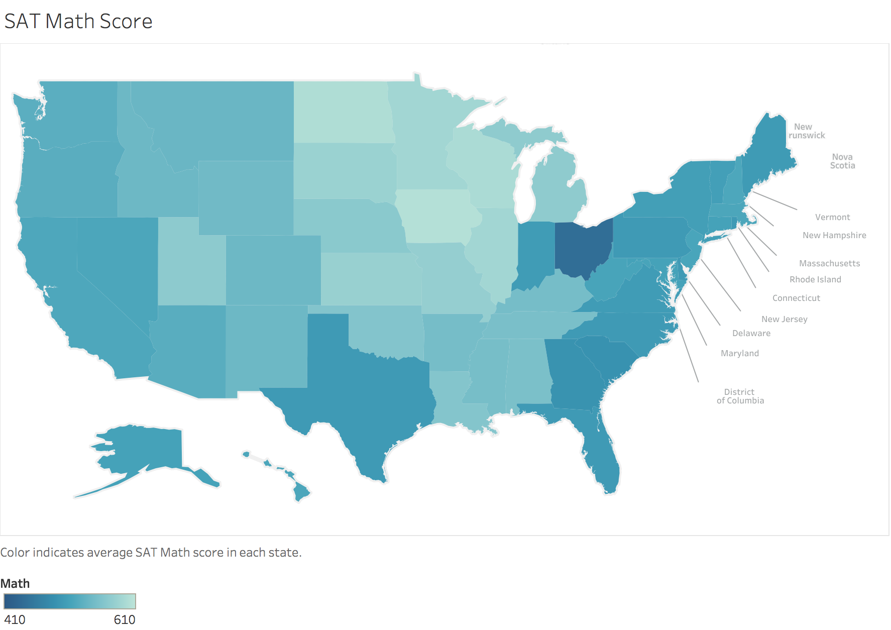

We worked with some data about SAT scores and test taking rates in every state over the last week.  I was able to use Tableau with some custom mapping options to keep the image looking professional.

I found a file defining polygons for each state at [Tableau Mapping][1].  I was able to follow the directions from a [tutorial by Steve Batt][2] which basically say:

- Open the saved map file from [Tableau Mapping][1]
- Add a **new connection** with your current data to be mapped
- Ensure the two data sets are joined properly (i.e. State ID  from the map 
  matches a column in the new data) by clicking the **join icon** between the 
  data set names  
- In a new Worksheet, ensure the Latitude and Longitude columns are **Measures**
- Drag **Longitude** to the **Columns** shelf and make sure the Aggregation is 
  set to average (i.e. it reads **AVG(Longitude)** on the pill)
- Drag **Latitude** to the **Rows** shelf and ensure it is an average too
- Change the drop-down box in the **Marks** card from **Automatic** to **Polygon**
- Ensure **PointID** is a **Dimension**, then drag it onto the **Path** section 
  of the**Marks** card
   + this will make lots of jagged edges!!
- Drag **PolygonID** into the **Marks** card as a **Detail**
   + this should fix all the jaggies!

Now you can drag the variable you want into the **Color** card to make the heat map!

[1]: https://tableaumapping.bi/2013/08/27/usa-states-offset-ak-hi/  "Tableau Maps"

[2]: http://blogs.lib.uconn.edu/outsidetheneatline/2016/05/12/creating-a-custom-polygon-map-for-connecticut-towns-in-tableau/   "Map Tutorial"

