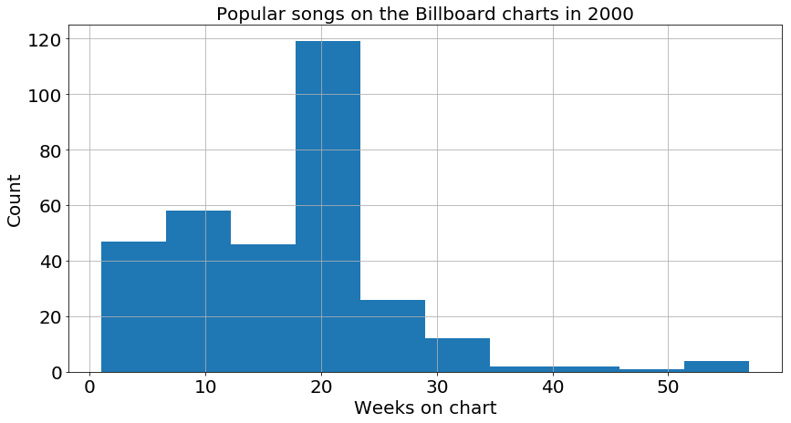

This week I am looking at the Billboard top 100 most popular songs for 
roughly the entire year 2000.  As with any project, the steps to a good 
analysis are:

1. Understand the structure of your data set
2. Clean and transform your data set
3. Explore the data and form hypotheses
4. Conduct the analysis
5. Create final visualizations


I am approaching this dataset from the mindset of a manager of an upcoming band.  I want to be able to advise them about how different genres perform in the charts.  Most notably, I am interested in the peak ranking, and also the duration tracks from each genre tend to stay in the charts.  With that in mind, let's get cracking!


## 1. Data structure

This dataset has 317 entries with 83 columns of data.  The first seven columns give details we are used to about the track: the year (which happens to be 2000 for every entry in this list), the artist name, track name, track length, and musical genre.  Then come the interesting data columns about each track's performance in the Billboard charts: the date each track first appeared on the chart, and the date each track peaked (reached its highest ranking), followed 76 columns storing each track's ranking for each week since it first entered the chart.

I did not question how any of these quantities were calculated, but simply charted the data as it appeared, while also doing a simple sanity check of researching a couple of the most popular songs of the year to make sure their performance matched my analysis of the data.  *Breathe* by Faith Hill, for example, I correctly identified as a massively popular song, but I see that its genre is listed as Rap.... though I, personally, would have considered it Country.  I see this exercise as vindication that I can correctly interpret the most important aspect of the data (i.e. the rankings), and caution should be taken before trusting data read from any table.

## 2. Data cleaning and transformation

At first glance, this dataset seemed remarkably complete.  Nearly every column was listed as completely full, and I thought just some simple type conversions and summarization would be required.  Careful reading of the `df.info()` result showed some trickery starting around column 30:

```
x24th.week         317 non-null object
x25th.week         39 non-null object
x26th.week         37 non-null object
x27th.week         30 non-null object
x28th.week         317 non-null object
```

Amidst the dozens of completely full columns lie three nearly empty ones!!  Further exploration showed that weeks 25-27 included null (np.NaN) values for entries where the track was not on the charts during that week, while all the others used asterisks (*).  A simple lambda function applied to all cells in the table converted all the columns to use the null value format.

With all the weekly ranking columns in a suitable format, I was able to summarize the rankings into a single column containing a tuple of the rankings, and then count the total number of weeks the track appeared on the charts.  I used lambda functions again to add these columns to the dataframe (note that I replaced the null values with 101 to make plotting easier), and then I dropped the 76 columns I wouldn't be needing anymore:

```python
df = df.applymap(lambda x: np.NaN if x=='*' else x)
df['week_list'] = df.iloc[:,7:].apply(lambda x: tuple([int(i) if i==i else 101 for i in x ]), axis=1)
df['weeks_on_list'] = df['week_list'].apply(lambda x: len([i for i in x if i<101]))
df = df.drop(df.columns[8:83], axis=1)
```

This cleaning and summarization process had the benefit of converting all the data into integers that would be easy to plot.  Now I just needed to convert the columns holding dates and times into a suitable format for plotting as well.  Luckily, the `pd.to_datetime` function was able to convert my track length, date entered and date peaked columns very easily.  The resulting datetime objects can be reformatted into any suitable form as required later.

I noticed that my genres column had some values that should be grouped together.  I cleaned them up with the following lambda functions to combine `Rock` with `Rock'n'Roll` and `R & B` with `R&B`:

```python
df['genre'] = df['genre'].apply(lambda x: 'Rock' if x=="Rock'n'roll" else x)
df['genre'] = df['genre'].apply(lambda x: 'R & B' if x=='R&B' else x)
```

I now have rankings for each week, the total number of weeks spent on the charts, and the track genres cleaned up and ready for analysis.  I'm really interested in combining the total ranking and duration of tracks on the chart to get a sense of their overall popularity.  For this, I created a function to combine those two aspects of each tracks performance into a score value that I store as a new column:

```python
def scoring(series):
    """Create a song score based on time spent at each rank in the list"""
    score = 0
    for i in series:
        if i < 10:
            score += 10
        elif i < 20:
            score += 9
        elif i < 30:
            score += 8
        elif i < 40:
            score +=7
        elif i < 50:
            score += 6
        elif i < 60:
            score += 5
        elif i < 70:
            score += 4
        elif i < 80:
            score += 3
        elif i < 90:
            score += 2
        elif i < 100:
            score += 1
    return score

df['score'] = df['week_list'].apply(scoring)
```

## 3. Data exploration and hypothesis iteration

The first step to exploration is to pick a variable and look at its plot, so I did a histogram of the number of weeks spent on the chart.  One can clearly see that many songs fall off the charts about 20 weeks after they enter.  Additionally, the distribution is weighted towards shorter durations, with just a few songs lasting significantly longer than the median.


